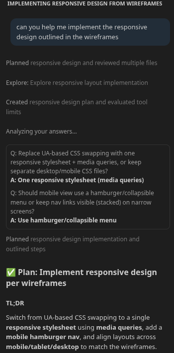

# KI Nutzung

---

## Struktur

Ich habe angefangen in dem ich Claude nach einer Struktur für eine generelle Richtung gefragt habe.

[Ganzer Chat](docs/ai_chat_1.html)

Ich habe herausgefunden das man mit einer Firefox Erweiterung Setiten komplett herunterladen kann.

---

## Struktur

Als nächstes habe ich KI Chatbots verglichen. Ich habe allen Chatbots etwa das Gleiche gesagt.

Mein Prompt
~~~
Hilf mir mal
Hier fehlt template für die Blogs

```
<!DOCTYPE html>
<html lang="de">
  <head>
    <meta charset="UTF-8" />
    <meta name="viewport" content="width=device-width, initial-scale=1.0" />
    <meta name="description" content="Ein Blog über Technologie, Wissenschaft und Alltag." />
    <title>Blog – Home</title>
    <link rel="stylesheet" href="assets/css/style.css" />
  </head>
  <body data-page="index">

    <header>
      <a href="index.html" class="logo">MeinBlog</a>
      <nav aria-label="Hauptnavigation">
        <ul>
          <li><a href="index.html" aria-current="page">Home</a></li>
          <li><a href="themen.html">Themen</a></li>
          <li><a href="kontakt.html">Kontakt</a></li>
        </ul>
      </nav>
    </header>

    <main>

      <section aria-labelledby="hero-heading">
        <h1 id="hero-heading">Willkommen auf MeinBlog</h1>
        <p>Artikel über Technologie, Wissenschaft und Alltag.</p>
      </section>

      <section aria-labelledby="neueste-artikel-heading">
        <h2 id="neueste-artikel-heading">Neueste Artikel</h2>
        <div id="artikel-liste" role="list">
          <!-- wird per JS befüllt -->
        </div>
      </section>

    </main>

    <footer>
      <p>&copy; 2025 MeinBlog</p>
      <nav aria-label="Footer-Navigation">
        <ul>
          <li><a href="index.html">Home</a></li>
          <li><a href="themen.html">Themen</a></li>
          <li><a href="kontakt.html">Kontakt</a></li>
        </ul>
      </nav>
    </footer>

    <script src="assets/js/main.js"></script>
  </body>
</html>
```
~~~

### Claude (sonnet 4.6)

Ich habe ungenau gefragt und auch kein gute antwort bekommen. Claude benötigt ein Konto.

[Ganzer Chat](docs/comp_claude.html)

### ChatGPT

Chat GPT ist weniger auf code fokussiert aber hat das Problem schneller gelöst.

[Ganzer Chat](docs/coml_chatgpt.html)

### Duck.ai (gpt mini)

Duck.ai hat nie etwas nützlichen geliefert.

[Ganzer Chat](docs/comp_duckai.html)

> Auch wenn ich genauer wäre sind die meisten Modelle zu stur um hilfreich zu sein. Persönlich finde ich Sonnet 4.5 und vielecht Opus am besten.

---

## Styleguide

Als nächstes habe ich KI gefragt mir ein Styleguide zu erstellen. Bis jetzt sind die meisten Dateien
 platzhalter um die Struktur zu Prüfen.

[Ganzer Chat](docs/ai_styleguide.html)

---

## CSS loader

Ich habe KI benutzt um zu schauen wie ich Desktop und Mobile CSS richtig setze. 
Die KI hat nie eine Perfekte Antwort ausgegeben aber war hilfreich so das ich es selber machen konnte.

---

## Responsive Design

Ich habe Wireframes erstellt und Github Copilot (raptor mini) gefragt das Projekt an die Bilder anzupassen.

Es ist nicht möglich Github Compilot Gespräche zu exportieren.


Ich habe Claude gefragt das Projekt anzupassen.


Ich habe ChatGPT gefragt Beispieldaten zu generrieren.


Ich habe Github Copilot gefragt Blogs jetzt mit den Beispieldaten anzuzeigen.

Github Copilot ist fast komplett nutzlos. Ich denke ich würde mehr hinbekommen den code hier selber zu schrieben.


Ich habe mit Claude das laden der Daten mit js in der Start-Seite zum laufen gebracht.


Ich Claude gefragt mit der Kategoreien Seite zu helfen.


Ich in Duck.ai Claude (Haiku 4.5) gefragt mit der Kategoreien Seite zu helfen.


Ich habe versucht Github Copilot zu benutzen um den Stil anzupassen aber 99% der Änderungen waren scheiße.
